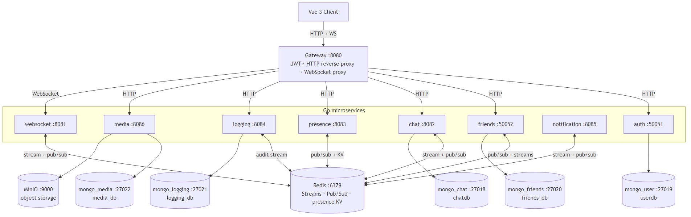

# GoMessenger

GoMessenger is a real-time chat platform built with Go microservices and a Vue 3 frontend.

<p align="center">
  
</p>

## Tech Stack

- Backend: Go microservices
- Frontend: Vue 3 + Vite
- Data: MongoDB
- Messaging and realtime backbone: Redis (Streams + Pub/Sub)

## Repository Structure

```text
GoMessenger/
├── backend/              # Go workspace: gateway + domain services + tests
├── frontend/             # Vue 3 web client
├── AGENTS.md             # Contributor guidance for AI agents and project conventions
└── README.md             # Project entrypoint
```

## Architecture Overview

The system is service-oriented (see diagram above). The gateway exposes a unified HTTP and WebSocket-facing surface while routing to internal services:

- `gateway` (`:8080`): public API and reverse proxy to internal services
- `auth` (`:50051`): register/login and JWT issuance
- `friends` (`:50052`): friend requests and relationships
- `websocket` (`:8081`): socket hub, token validation, realtime bridge
- `chat` (`:8082`): message history and persistence
- `presence_service` (`:8083`): online presence state
- `logging` (`:8084`): audit logs
- `notification` (`:8085`): user notification pipeline
- `media` (`:8086`): attachment metadata and object storage proxy

High-level chat flow:

1. Client authenticates through `gateway` -> `auth`.
2. Client connects over WebSocket through `gateway` -> `websocket`.
3. `websocket` publishes messages to a Redis stream.
4. `chat` consumes, persists to MongoDB, then publishes events.
5. `websocket` fans persisted events back to connected clients.

## Prerequisites

- Go (current stable release recommended)
- Node.js and npm
- Docker Desktop (or Docker Engine + Compose)

## Local Development

### 1) Start infrastructure

From `backend/`:

```bash
docker-compose up -d
```

This starts Redis and MongoDB instances used by the services.

### 2) Start backend

From `backend/`:

```bash
go run ./cmd/dev
```

The API gateway is available at `http://localhost:8080`.

### 3) Start frontend

From `frontend/`:

```bash
npm install
npm run dev
```

The UI runs at `http://localhost:5173` and talks to the gateway at `http://localhost:8080`.

## Configuration

- Backend environment template: `backend/.env_example`
- Main backend docs (ports, services, message flow, data model): `backend/README.md`
- Service conventions and architecture notes: `backend/AGENTS.md`

## Testing

From `backend/`, use the provided scripts:

```bash
./scripts/test_all.sh
```

If you need to run layers separately:

- `./scripts/test_unit.sh`
- `./scripts/test_integration.sh`

## Additional Documentation

- Backend architecture diagrams (Mermaid): [`backend/docs/architecture.md`](backend/docs/architecture.md)
- Backend architecture and APIs: [`backend/README.md`](backend/README.md)
- Backend contributor guide: [`backend/AGENTS.md`](backend/AGENTS.md)
- Frontend guide: [`frontend/AGENTS.md`](frontend/AGENTS.md)
- Project-level conventions: [`AGENTS.md`](AGENTS.md)
